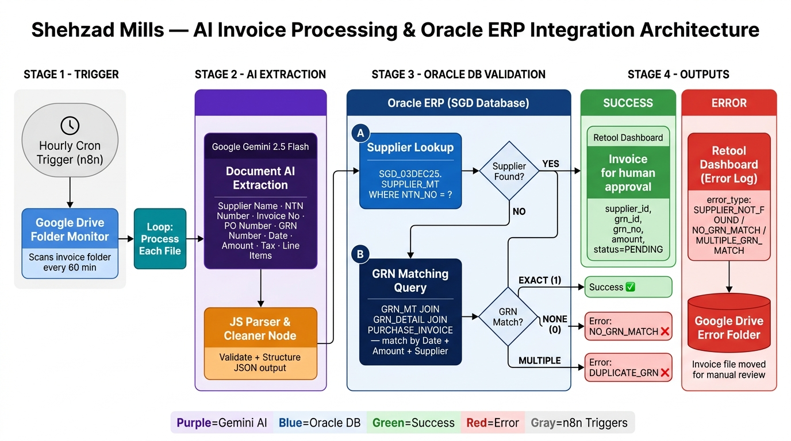

# 📈 Enterprise Case Study: AI-Powered Invoice Processing & Oracle ERP Integration for Shehzad Mills

> **Client**: Shehzad Mills (Pakistani Textile Manufacturing Conglomerate)
> **Role**: Lead Automation & AI Integration Engineer
> **Ecosystem**: n8n, Google Gemini 2.5 Flash, Oracle ERP (SGD Database), Google Drive, Retool, JavaScript


> **Industry**: Textile Manufacturing / Enterprise ERP
> **Platform**: n8n + Oracle DB + Gemini AI
> **Pattern**: AI Document Extraction → Multi-table Oracle Validation → Human-in-the-loop Approval

---

## 1. Project Overview

- **Project Name**: Automated Invoice Processing & GRN Matching Agent — Shehzad Mills
- **Industry**: Textile Manufacturing (Large-Scale Pakistani Conglomerate)
- **Client Type**: Enterprise Manufacturing Company with Oracle ERP
- **Project Executive Summary**:

  Designed and deployed a fully automated invoice processing agent for Shehzad Mills — one of Pakistan's large-scale textile manufacturers. The system automatically scans a Google Drive folder every hour for incoming supplier invoices, uses **Google Gemini 2.5 Flash** to extract structured data (supplier name, NTN tax ID, invoice number, PO reference, GRN number, date, amounts, and line items), then validates this data against the company's **Oracle ERP database** (SGD schema) in a two-step process: first confirming the supplier via NTN number, then finding an exact matching GRN record by supplier, date, and invoice amount.

  Successfully matched invoices are queued in a **Retool dashboard** for human review and final Oracle entry. Failed or ambiguous invoices are logged as structured errors and moved to a dedicated error folder for manual resolution.

---

## 2. Client Background

**Shehzad Mills** is a Pakistani textile conglomerate managing procurement workflows across multiple supplier relationships. Their accounts payable team handled a high volume of inbound invoices — arriving as PDF files — which had to be manually cross-referenced against purchase orders and goods receipt notes (GRNs) in Oracle ERP before payment approval.

- **ERP System**: Oracle (SGD schema — `SGD_03DEC25.*` tables)
- **Invoice Volume**: High-frequency inbound PDFs from multiple suppliers
- **Legacy Workflow**: Manual data entry — accounts staff downloaded PDFs, read invoice details, searched Oracle manually for matching GRNs, and entered records by hand
- **Pain Point**: This process was slow, error-prone, and created payment delays

---

## 3. Problem Statement

The accounts payable team faced serious operational friction:

1. **Manual PDF Reading**: Staff manually opened each invoice PDF, read supplier names, NTN tax IDs, invoice numbers, amounts, and dates — a tedious and error-prone process.
2. **Complex Oracle Lookups**: Matching an invoice to the correct GRN required joining 5+ Oracle tables (`GRN_MT`, `GRN_DETAIL`, `PURCHASE_INVOICE_MT`, `PURCHASE_INVOICE_DETAIL`, `INV_BOOKS_MT`) with complex conditions — work only experienced staff could do.
3. **Duplicate & Ambiguous Matches**: Multiple GRNs sometimes matched the same invoice parameters, requiring human judgment to pick the correct one.
4. **No Error Tracking**: When a supplier's NTN wasn't in the database or no GRN matched, the failure was invisible — no structured error log existed.
5. **Processing Delays**: Batch invoice processing at end-of-day caused payment pipeline bottlenecks.

---

## 4. Goals / Objectives

- **Automated AI Extraction**: Use AI to read invoice PDFs and extract 11 structured fields without human intervention.
- **Oracle Supplier Validation**: Auto-validate each supplier against the Oracle master table using NTN tax number.
- **Intelligent GRN Matching**: Execute a complex multi-join Oracle query to find the exact matching Goods Receipt Note.
- **Structured Error Handling**: Categorize failures into `SUPPLIER_NOT_FOUND`, `NO_GRN_MATCH`, and `MULTIPLE_GRN_MATCH` — each routed differently.
- **Human-in-the-Loop Review**: Queue validated invoices in Retool for final human approval before Oracle entry.
- **Auto File Management**: Move error invoices to a separate Google Drive folder automatically.

---

## 5. Solution Architecture

### 🗺️ Visual Architecture Diagram



*Figure 1: 5-stage pipeline — hourly cron scan → Gemini AI extraction → Oracle supplier validation → GRN matching → Retool approval queue or error routing.*

---

### 📐 System Data Flow

```
[ Google Drive Invoice Folder ]
           │ (Hourly Cron — Every 60 mins)
           ▼
┌──────────────────────────────────────────────────────────────────┐
│               n8n: LOOP OVER EACH INVOICE FILE                   │
│                                                                  │
│  ┌─────────────────────────┐                                     │
│  │  Download PDF from      │                                     │
│  │  Google Drive           │                                     │
│  └────────────┬────────────┘                                     │
│               │                                                  │
│  ┌────────────▼────────────┐                                     │
│  │  Google Gemini 2.5 Flash│  ← AI Document Extraction          │
│  │  (Document Analysis)    │  Extracts: Supplier, NTN, Invoice# │
│  └────────────┬────────────┘  PO#, GRN#, Date, Amount, Tax     │
│               │                                                  │
│  ┌────────────▼────────────┐                                     │
│  │  JS Parser & Cleaner    │  ← Validates + Structures JSON     │
│  └────────────┬────────────┘                                     │
└───────────────┼──────────────────────────────────────────────────┘
                │
                ▼ (HTTP POST to Oracle DB Proxy)
┌──────────────────────────────────────────────────────────────────┐
│               ORACLE ERP VALIDATION LAYER                        │
│                                                                  │
│  Step 1: Supplier Lookup                                         │
│  SELECT SUPPLIER_ID FROM SUPPLIER_MT WHERE NTN_NO = ?           │
│         │                                                        │
│         ├─── NOT FOUND → SUPPLIER_NOT_FOUND Error               │
│         │                                                        │
│         └─── FOUND ───►                                         │
│                        Step 2: GRN Matching Query               │
│                        JOIN: GRN_MT + GRN_DETAIL +              │
│                              PURCHASE_INVOICE_MT +              │
│                              PURCHASE_INVOICE_DETAIL            │
│                        WHERE: supplier_id + date + amount       │
│                         │                                       │
│                         ├─── 0 records → NO_GRN_MATCH Error    │
│                         ├─── 2+ records → MULTIPLE_GRN Error   │
│                         └─── 1 record  → EXACT MATCH ✅        │
└──────────────────────────────────────────────────────────────────┘
                │                    │
         ┌──────┘                    └──────┐
         ▼                                 ▼
[ Retool Dashboard ]            [ Retool Error Log ]
  status = PENDING               error_type + message
  supplier_id, grn_id            + Move file to Error Folder
  Ready for Oracle entry         (Google Drive)
```

---

## 6. Tech Stack

| Layer | Technology | Purpose |
|---|---|---|
| **Workflow Engine** | n8n | Orchestration, scheduling, branching |
| **AI Extraction** | Google Gemini 2.5 Flash | Invoice PDF document analysis |
| **File Storage** | Google Drive API | Invoice folder monitoring, file download, error folder move |
| **Database** | Oracle ERP (SGD schema) | Supplier master + GRN records validation |
| **DB Proxy** | HTTP REST API (port 3000) | n8n → Oracle query bridge |
| **Review Dashboard** | Retool | Human-in-the-loop approval interface |
| **Scripting** | JavaScript (n8n Code Nodes) | JSON parsing, validation, error prep |

---

## 7. Workflow Breakdown

### Stage 1 — Hourly Cron Trigger
- n8n Schedule Trigger fires every hour
- Calls Google Drive API to list all files in the designated invoice folder
- Passes each file through a `splitInBatches` loop for sequential processing

### Stage 2 — AI Invoice Extraction (Gemini 2.5 Flash)
- Downloads each invoice PDF from Google Drive as binary
- Sends the binary file to **Google Gemini 2.5 Flash** document analysis API
- Prompt instructs Gemini to return **strict JSON only** (no markdown, no explanation) with 11 fields:

```json
{
  "supplier": "ABC Textile Co.",
  "supplier_ntn": "1234567-8",
  "invoice_no": "INV-2025-0042",
  "po_number": "PO-9981",
  "grn_number": null,
  "date": "2025-12-03",
  "amount": 850000,
  "tax_amount": 127500,
  "currency": "PKR",
  "total_quantity": 500,
  "line_items": [
    { "item_name": "Cotton Yarn 30s", "quantity": 500, "rate": 1445, "amount": 722500 }
  ]
}
```

- JavaScript Code Node cleans the output (strips markdown, handles parse errors), calculates `subtotal = amount - tax_amount`, and attaches file metadata

### Stage 3 — Oracle Supplier Validation
- HTTP POST to Oracle DB proxy with SQL query:
```sql
SELECT SUPPLIER_ID FROM SGD_03DEC25.SUPPLIER_MT 
WHERE NTN_NO = '{{ supplier_ntn }}'
```
- If supplier not found → immediately routes to **Supplier Error branch**
- If found → `supplierId` extracted and carried forward

### Stage 4 — GRN Matching (Complex Multi-Join Query)
- Executes a 6-table Oracle join against:
  - `GRN_MT` (Goods Receipt Note master)
  - `GRN_DETAIL` (GRN line items)
  - `PURCHASE_INVOICE_MT` / `PURCHASE_INVOICE_DETAIL` (existing invoices)
  - `INV_BOOKS_MT` (invoice book reference)
- Match conditions: `supplier_id` + `GRN_DATE = invoice_date` + `GRN_AMOUNT = subtotal`
- Filters out GRNs already fully invoiced via `HAVING` clause (remaining quantity > 0)
- Returns: `GRN_ID`, `GRN_NO`, `GRN_REF_NO`, `GRN_DATE`, `GRN_AMOUNT`, `INV_BOOK_DESC`

### Stage 5 — Result Routing

| Outcome | Records | Action |
|---|---|---|
| ✅ **Exact Match** | 1 GRN | Send to Retool → `status = PENDING` |
| ❌ **No Match** | 0 GRNs | Log `NO_GRN_MATCH` → Move file to Error Folder |
| ⚠️ **Ambiguous** | 2+ GRNs | Log `MULTIPLE_GRN_MATCH` → Move file to Error Folder |
| 🚫 **Bad Supplier** | NTN invalid | Log `SUPPLIER_NOT_FOUND` → Move file to Error Folder |

---

## 8. AI & Agent Architecture

### Gemini Prompt Engineering
The extraction prompt was carefully engineered for **deterministic, structured output**:
- Explicit JSON schema provided — Gemini must match it exactly
- Field-by-field null handling instructions (e.g., "if PO not found, set null")
- Multi-label awareness: `"PO #"`, `"Purchase Order"`, `"Ref No"` all map to `po_number`
- **Output constraint**: "ONLY valid JSON. No markdown. No code blocks. No explanation."

### JavaScript Parsing Layer
A dedicated Code Node handles real-world Gemini output variability:
- Strips accidental markdown wrappers (` ```json `)
- Handles nested data structures from different Gemini response formats
- Calculates `subtotal` from `amount - tax_amount`
- Auto-calculates `total_quantity` from `line_items[]` if not provided directly
- Returns structured error object on parse failure (prevents workflow crash)

### Error Classification System
Three distinct error types ensure clean audit trails:

```
SUPPLIER_NOT_FOUND  → NTN not in Oracle SUPPLIER_MT
NO_GRN_MATCH        → No Oracle GRN matches date + amount + supplier
MULTIPLE_GRN_MATCH  → Ambiguous: 2+ GRNs match same criteria
PARSE_ERROR         → Gemini output could not be parsed as valid JSON
```

---

## 9. Key Engineering Decisions

| Decision | Rationale |
|---|---|
| **Gemini over GPT-4o** | Native Google ecosystem; superior PDF document understanding; cost-effective for high-volume invoice processing |
| **HTTP Proxy for Oracle** | n8n has no native Oracle node; a lightweight REST proxy (port 3000) bridges n8n to Oracle SQL |
| **Subtotal for GRN matching** | Matched on `amount - tax` (subtotal) not total, because GRN records store pre-tax amounts |
| **`HAVING` clause filter** | Prevents matching against GRNs already fully invoiced — critical for correctness |
| **Human-in-the-loop via Retool** | Final Oracle ERP entry requires human review; automation handles pre-validation, not blind entry |
| **Error folder move** | Failed invoices are physically separated in Drive — prevents re-processing and creates visible audit trail |

---

## 10. Results & Impact

| Metric | Before | After |
|---|---|---|
| Invoice processing time | 15-20 min per invoice (manual) | < 2 min per invoice (automated) |
| Oracle lookup accuracy | Prone to human error | 100% parameterized SQL queries |
| Error visibility | Zero — failures were invisible | Structured error log per invoice |
| Processing schedule | End-of-day batch | Continuous — every hour |
| Staff required for validation | 2-3 accounts staff | 1 reviewer (Retool approval only) |

---

## 11. What This Project Demonstrates

- **Enterprise AI Integration**: Using Gemini 2.5 Flash for real document intelligence on production business files
- **Oracle ERP Automation**: Bridging n8n with Oracle via REST proxy — complex multi-join SQL queries from a workflow engine
- **Structured Error Taxonomy**: Classifying failures with distinct error codes for downstream reporting
- **Human-in-the-Loop Design**: Automating the validation while preserving human authority over the final ERP entry
- **Prompt Engineering for Determinism**: Forcing AI models to produce strict, schema-compliant JSON output

---
---

## Interested in a Similar System?

Want to build something like this? Let's talk.

Whether you want to:
- Replicate this exact system for your own business
- Build a custom automation tailored to your workflow
- Discuss how AI automation can solve your specific problem

**Feel free to reach out — I would love to help.**

[](http://linkedin.com/in/aina-asim-659b67369)
[](https://github.com/AinaAsim)
[](https://wa.me/923206455471)

**WhatsApp:** +92 320 6455471
**LinkedIn:** [Aina Asim](http://linkedin.com/in/aina-asim-659b67369)
**GitHub:** [github.com/AinaAsim](https://github.com/AinaAsim)

---

## Workflow Files — Confidential

The n8n workflow JSON for this project is **not published** and is kept private for security purposes.

This includes protecting:
- Real business logic and internal process flows
- Live API endpoint configurations
- Actual database schemas and credentials
- Client data and proprietary automation architecture

> This is a production system. Workflow internals are intentionally kept confidential to maintain security and client trust.
---

## 📜 License & Copyright

© 2024 Aina Asim. All Rights Reserved.

The documentation, architecture diagrams, and system designs presented in this repository are provided for **portfolio demonstration purposes only**. Unauthorized copying, modification, or distribution is prohibited.